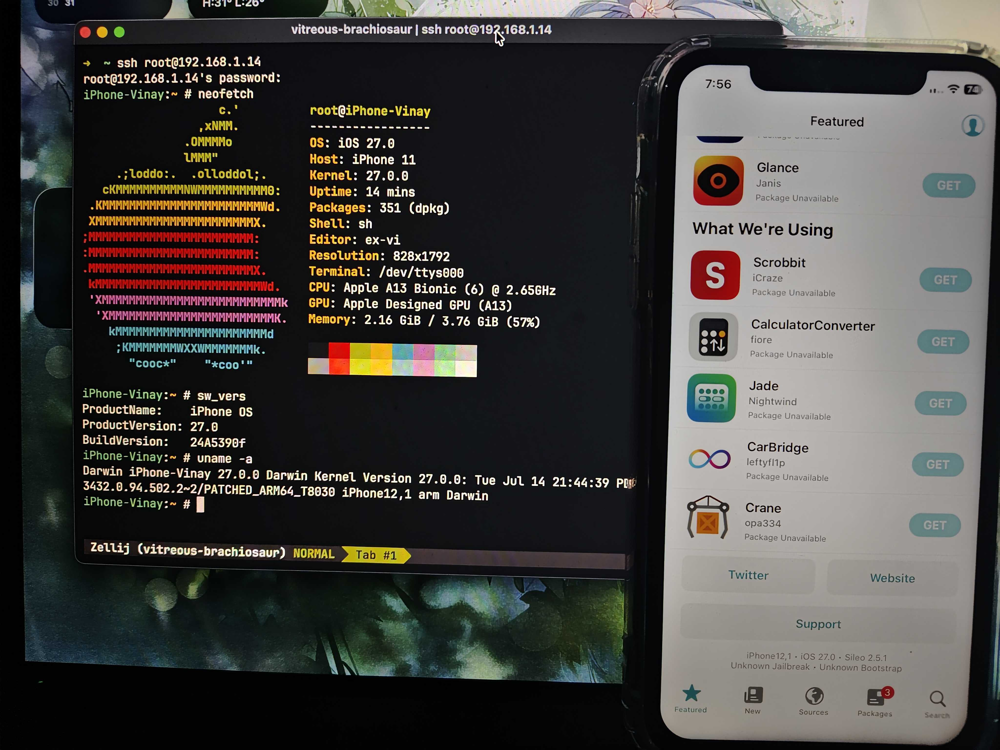

# work-27.0b4-n104

iOS **27.0 beta 4** (`24A5390f`) on **iPhone 11** (`iPhone12,1` / `n104ap`), tethered via the usbliter8 checkm8-class SecureROM exploit.

### ONLY WORKS WITH APPLE SILICON MACS

Everything this port needs is in this directory. The only thing shared with the rest of the repo is `../tools/`.

This file is the setup path, start to finish. Once it is built and flashed, `COMMANDS.md` is the day to day cheatsheet.



The `uname -a` line is the one that matters: `PATCHED_ARM64_T8030 iPhone12,1`. `PATCHED` rather than `RELEASE` comes from the `KC_KERNELNAME` table, so a booted device says out loud which kernel it is running. Alongside it, `sw_vers` confirms `24A5390f`, and dpkg reports 351 packages.

---

## Read this first: different board from b2 and b3

`work-27.0b2` and `work-27.0b3` target **`d421ap`** (iPhone 11 Pro Max) and **`d431ap`** (iPhone 11 Pro). This directory targets **`n104ap`** (iPhone 11).

Same SoC (T8030), different board. Do not mix the directories:

- the display panel differs and needs a patch b2/b3 do not have, see step 5
- `get_fw.py` here fetches a different device **and** build. Upstream's fetches `iPhone12,3,iPhone12,5` / `24A5380h`
- every firmware filename is board-tagged: `iBSS.n104.RELEASE.im4p`, `DeviceTree.n104ap.im4p`, `adc-zelus-n104.im4p`, `sep-firmware.n104.RELEASE.im4p`

---

## Prerequisites

```sh
brew install blacktop/tap/ipsw            # resolves the IPSW URL, decrypts AEA payloads
brew install libimobiledevice              # idevicerestore, irecovery
brew install python@3.14                   # see the note below
pip3 install pyimg4 requests
```

[BUILD IDEVICERESTORE FROM SOURCE!!! BREW DOESN'T HAVE FORMULAS FOR WHAT WE NEED](https://github.com/libimobiledevice/idevicerestore#macos)

Also drop the binary ldid for macOS arm64 in `tools/`!

About 20 GB free. An RP2350 / Pico 2 running usbliter8. All commands run **from this directory**.

`make_cfw.py`, `get_boot.py`, `get_rd.py` and `tss_proxy_server.py` carry a `#!/usr/bin/env python3.14` shebang, inherited from upstream b2/b3. Nothing in them actually needs 3.14: between them they import only `struct os sys glob subprocess pathlib http.server urllib.request`. If you would rather not install that exact version, either change the four shebangs to `python3` or run them as `python3 ./make_cfw.py`. Everything else here uses plain `python3`.

---

## Step 1: get the firmware

```sh
./get_fw.py
```

Downloads `iPhone12,1` build `24A5390f` and extracts to `iPhone12,1_27.0_24A5390f_Restore/` here, the same convention b2/b3 use. Then it reads the extracted `BuildManifest.plist` and refuses to continue unless it sees `ProductBuildVersion 24A5390f`, `SupportedProductTypes` containing `iPhone12,1`, and device class `n104ap`. A wrong or renamed archive fails here rather than producing a subtly wrong `CFW/`.

If you already have the firmware extracted somewhere else, skip this step entirely and set `IPSW_SRC=/path/to/extracted` when running step 2. That variable is read by `make_cfw.py`, `get_boot.py` and `get_rd.py`; `get_fw.py` ignores it and always downloads to this directory.

The two AEA-encrypted payloads are **not** needed to build. Decrypt them only to pull files out for analysis; keys for this build are public:

```sh
ipsw fw aea --key-val 'base64:ei61kkuQ/ECeRytNoqaofHMtQUUHVovQMfKXpD9hR74=' \
    iPhone12,1_27.0_24A5390f_Restore/094-13328-107.dmg.aea --output aea_out   # root filesystem
ipsw fw aea --key-val 'base64:FsLQw9m+E0kTZMWw9av/qV8u/jvEwUIY4teP9CIQOJ0=' \
    iPhone12,1_27.0_24A5390f_Restore/094-14805-111.dmg.aea --output aea_out   # Cryptex, holds the DSC

hdiutil attach -readonly -nobrowse -mountpoint /tmp/ios27-rootfs aea_out/094-13328-107.dmg
```

`/tmp/ios27-rootfs` is where `fetch_payloads.sh` and `sshrd_provision.sh` expect the root filesystem later.

---

## Step 2: build the CFW

```sh
./make_cfw.py
```

Copies the IPSW into `CFW/` (~10 GB, the slow part, resumable), then patches iBSS, iBEC, DeviceTree, the restore ramdisk, TXM and the kernelcache. It calls `verify_cfw.py` at the end.

---

## Step 3: flash

The restore needs the TSS proxy running. **`restore_cfw.sh` points `idevicerestore` at `http://127.0.0.1:1337` and fails without it.**

```sh
python3 tss_proxy_server.py.       # leave running in another window
./restore_cfw.sh                   # ERASES THE DEVICE
```

Put the device in pwn DFU first.

---

## Step 4: dump your APTicket

**There is deliberately no `t8030_apticket.der` here.** It is bound to your device's ECID *and* to the restore, so a committed one is useless to anyone else and stale for you after the next restore. A stale ticket boots to a black screen.

You can get it from logs of tss_proxy_server.py

Boot the SSH ramdisk, mount /mnt6 to /dev/disk1s6, find the ticket, pull it back:

```sh
./get_rd.py && ./boot_rd.sh        # device in pwn DFU
# on the device, over SSH:
/sbin/mount_apfs /dev/disk1s6 /mnt6
find /mnt6 -name sep-firmware.img4
# pull that file back here as dev_sep.img4, then:
../tools/img4tool -e -m t8030_apticket.der dev_sep.img4
```

Repeat this after **every** restore.

---

## Step 5: skip Setup

TODO... 👀

---

## Step 6: install the bootstrap and dropbear

Device in SSHRD. Both scripts run from the Mac and take `--check` to report without changing anything.

```sh
./install_bootstrap.sh --check
./install_bootstrap.sh                 # Procursus rootless bootstrap -> /var/jb
./install_dropbear.sh --check
./install_dropbear.sh                  # dropbear onto the System volume
```

**The bootstrap is a prerequisite, not an optional extra.** `sshrd_provision.sh` only warns if `/var/jb` is missing, it does not create it, and Sileo cannot load its dylibs without it. `bootstrap_1900.tar.zst` is here, byte-identical to the copy in `../work-27.0b2/`.

dropbear is what gives you SSH on a normal boot, paired with the `com.dropbear` job that `fetch_payloads.sh` adds to the launchd cache in step 7.

---

## Step 7: build the device payloads

```sh
cd spawnprobe && ./build.sh && cd ..     # personaalloc, needed by the boot job
cd photodiag  && ./build.sh && cd ..     # optional probe
./fetch_payloads.sh
```

`fetch_payloads.sh` builds Sileo from its upstream release into `payload/`, and builds the patched launchd service cache into `boot/work/launchd.plist` by taking the stock cache out of the IPSW and running `patch_launchd_cache.py` (adds `com.dropbear`) and `add_jbboot.py` (adds `com.jbboot`) over it. It needs the root filesystem mounted at `/tmp/ios27-rootfs` from step 1.

**Build `spawnprobe` first.** `sshrd_provision.sh` installs `personaalloc` from there and `boot/jbboot.sh` exists only to run it at each boot. Missing binaries are skipped silently rather than failing, so the symptom is a persona that never appears, not an error.

---

## Step 8: provision the System volume

Device in SSHRD:

```sh
./sshrd_provision.sh --check           # dry run first
./sshrd_provision.sh
```

Steps it runs: `mounts cache jbtools sileo resolv apps verify`. It refuses to run against a normal boot.

`sileo` installs the bundle built in step 7. Its binaries are re-signed ad-hoc with no `get-task-allow`, and `giveMeRoot` keeps its setuid bit; without that Sileo cannot escalate and installs fail silently. Working installs also need the apt archive dir owned by `mobile`, which step 6 handles.

TrollStore is deliberately not installed here. It used to be, as the full TrollStore renamed to `TrollStoreLite.app`, whose helper cannot register apps on iOS 27: `registerApplicationDictionary:` is a stub that always returns NO, and the replacement API is entitlement-gated. It now installs after first boot from a deb built from a patched fork, which also keeps it off the sealed System volume so it can be updated without another DFU trip. See COMMANDS.md section 5.

`apps` copies the 50 removable system apps into `/Applications`, building `payload/apps50.tar.gz` (659 MB) on first use from the mounted IPSW. Apps must be in `/Applications`; `/var/staged_system_apps` is never scanned for registration.

---

## Step 9: normal boot

```sh
./get_boot.py && ./boot.py             # device in pwn DFU
```

`get_rd.py` and `get_boot.py` both write `Ramdisk/`. Whichever ran last is what boots:

```sh
ls Ramdisk/ | grep -c RestoreRamdisk    # 1 = SSHRD, 0 = normal
```

On the device, register the apps once:

```sh
uicache -a -f
```

`-a` rebuilds the databases. `uicache -p` cannot register anything on iOS 27.

`boot.py` is a zsh script despite the `.py` name, inherited from upstream.

---

## Optional: a usable SSH shell

Not required for anything, but a restore wipes `/var`, so it is a script rather than something to redo by hand.

```sh
./setup_shell.sh --check
./setup_shell.sh
```

Out of the box you land on `-sh-3.2#` with no prompt, dropbear warns twice per login that `/var/log/lastlog` is missing, and zsh has to be started by hand. This writes `/var/root/.profile`, `.zshrc` and `.zprofile` from `shell/`, creates `lastlog`, and leaves a prompt that shows the device name and, in red, whether you are in SSHRD:

```
iPhone-11:~ #                    normal boot
[SSHRD] iPhone-11:~ #            SSH ramdisk
```

That marker is the point of it. The two modes are otherwise indistinguishable at the prompt, and writing to the wrong one edits the ramdisk instead of the System volume.

Runs on a **normal boot** and refuses SSHRD, the mirror image of `sshrd_provision.sh`. Everything it touches is on the Data volume, so it needs no DFU cycle. Requires the bootstrap from step 6, since zsh comes from there. Originals are kept as `.orig` on first run.

---

## The n104 gotcha that will cost you a day: black display

On n104 the chain comes up with a **completely black screen** while everything else works. Not a hang: USB, SSH and the kernel are all fine behind it.

The fix is **one word in iBSS**, applied automatically by `get_boot.py` as the `ibss-skip-display-init` table:

```
0x351c8   94018575  ->  52800020
          bl <display init>   ->   movz w0, #1
```

That makes iBSS take its own failed-init path, leaving the panel in a state iBEC then brings up correctly.

**iBSS only, never iBEC.** iBSS and iBEC are byte-identical on this build, so it is tempting to fold this into the shared table. Do not: applying it to iBEC disables the very init this exists to let succeed. Cause is that iBSS leaves the DSI link up and running video, then iBEC re-runs `pinot_init`, whose Generic Read of panel register `0xb1` is not serviceable in that state, times out, returns -1, and the wrapper quiesces the DSIM.

Also required and easy to miss: `backlight-level=1024` in the normal-boot boot-args. n104 is an LCD and needs the backlight driven explicitly; the d421 OLED this chain was written for does not. iBEC normally appends this itself, but only when its display-object lookup succeeds, which on this board it does not.

A sky-blue Apple logo during the iBEC stage is normal.

---

## Layout

Build and patching, all b4/n104-specific:

```
apply_patches.py     every binary patch, asserted
verify_cfw.py        confirms patches survived repacking
get_fw.py            firmware download + extract + verify
make_cfw.py          build, restore chain
get_rd.py            build, SSH ramdisk chain
get_boot.py          build, normal boot chain
patch_dt.py          DeviceTree, restore and ramdisk
patch_dt2.py         DeviceTree, normal boot (imports patch_dt.py)
patch_setup.py       Setup.app pane skip, run by hand (step 5)
ramdisk_patch.py     restore ramdisk mount, patch, re-sign, rebuild
repack.py            IM4P repack utility, see note below
tss_proxy_server.py  TSS proxy for the restore, run by hand (step 3)
boot.py boot_rd.sh restore_cfw.sh
```

Device provisioning:

```
install_bootstrap.sh    Procursus rootless bootstrap -> /var/jb  (prerequisite)
install_dropbear.sh     dropbear onto the System volume -> SSH on normal boot
setup_shell.sh          optional, installs shell/ dotfiles + lastlog
shell/profile           PATH, and hands interactive logins to zsh
shell/zshrc             PATH, history, completion, prompt with the SSHRD marker
aptproxy.py             DNS fallback, see COMMANDS.md section 8
fetch_payloads.sh       builds Sileo and the launchd cache into payload/
sshrd_provision.sh      writes everything to the read-only System volume
patch_launchd_cache.py  adds com.dropbear to the signed cache
add_jbboot.py           adds com.jbboot to the same cache
boot/jbboot.sh          per-boot setup run by launchd; builtins only
spawnprobe/             personaalloc + persona probes, source and build.sh
photodiag/              photo library probe, source and build.sh
bootstrap_1900.tar.zst  the bootstrap archive, 20.7 MB
ssh.tar.gz              dropbear and friends
```

`repack.py` is **not wired into the build**: `make_cfw.py` still does its own PAYP re-append inline. `repack.py` reads the fourcc, description and ASN.1 length widths from the original rather than hardcoding them, and reproduces Apple's iBEC byte for byte. Useful when porting to a build where the hardcoded slices stop being right.

---

## All patches are asserted. Do not bypass this.

Every patch declares the exact word it expects to overwrite. A wrong build, wrong file, or already-patched file aborts rather than producing a subtly broken image. On a tethered device a bad build costs a DFU cycle.

```sh
./apply_patches.py --list                    # all tables
./apply_patches.py kc-boot kcache.raw        # dry run, verifies only
```

| table | words | stage |
| --- | --- | --- |
| `ibss-restore` | 5 | restore chain, iBSS + iBEC |
| `ibss-ramdisk` | 5 | SSHRD chain, iBSS + iBEC |
| `ibss-normal` | 5 | normal boot, iBSS + iBEC |
| `ibss-skip-display-init` | 1 | **the display fix**, iBSS only |
| `txm-restore` / `txm-boot` | 5 / 7 | TXM |
| `kc-restore` | 18 | kernelcache, restore |
| `kc-boot` | 114 | kernelcache, normal boot |
| `restored_external` / `asr` | 1 each | restore |
| `mobileactivationd` / `coreauthd` / `ctkd` | 5 / 1 / 2 | post-boot usability |

The three `ibss-*` tables share the same signature patches and differ only in boot-args, one per boot mode. They are not redundant.

Diagnostics, never invoked automatically, kept because the next board port will need them:

| table | words | purpose |
| --- | --- | --- |
| `kc-diag` | 40 | drops the panic silencers so a failure panics with a log naming the check, instead of hanging silently |
| `ibec-diag-ignore-pinot-id-failure` | 1 | display debugging |
| `ibec-diag-force-pinot-id` | 2 | display debugging, refuses to run without `--pinot-id` |

---

## Why `KC_AKS` looks over-engineered

Read this before touching it. The obvious simplification reintroduces a bug that took a long time to find.

SEP does not boot on this CFW, so every AppleKeyStore call fails. **66 of `kc-boot`'s 114 words exist to neutralise SEP.** Upstream stubs `AppleKeyStoreUserClient::externalMethod` to `mov x0, #0 ; ret`, an unconditional `KERN_SUCCESS`.

That returns success **without running any selector handler**, so output buffers are never written. `MobileKeyBag` zeroes its output word before calling, then reads bit 2 of it, and concludes the device has never been unlocked since boot. Permanently. That one false answer is why the photo library refuses to exist, why wallpapers fail, and why pairing has no key pair.

Reverting the stub does not help either: selector 7 returned `kIOReturnNotReady` before any stub existed, because there is genuinely no SEP. Both branches fail the caller's `cmp w0, 1`.

So the state has to be **synthesised**. `KC_AKS` validates the arguments and writes a coherent lock state for selector 7 only, leaving every other selector exactly as before:

```
cmp  w1, #7                  selector
b.ne Lok                     everything else: unchanged
ldr  x8, [x2, #0x20]         scalarInput,       checked non-NULL
ldr  w8, [x2, #0x28]         scalarInputCount,  must be 1
ldr  x9, [x2, #0x48]         scalarOutput,      checked non-NULL
ldr  w8, [x2, #0x50]         scalarOutputCount, must be 1
mov  x8, #6                  noPin | beenUnlocked, locked clear
str  x8, [x9]
```

`locked = 0x1`, `noPin = 0x2`, `beenUnlocked = 0x4`. The entry `pacibsp` at `0x213ac00` is deliberately left in place: it is the BTI landing pad for an indirect virtual call and the PAC pairing for the `retab`s.

With this in place `Photos.sqlite` builds itself about a minute after boot. It does not fix `MKBGetDeviceLockState`, which reaches AKS by a different path.

---

## What works

WiFi, 46 home screen icons, 266 apps registered, root shell over SSH, apt, Sileo including installs, Camera and Photos, Safari including downloads reaching Files, AirDrop, Siri, persona 99 created at boot.

**Sileo installs.** It fetches as `mobile` and only installs as root, so `/var/jb/var/cache/apt/archives` and its `partial/` have to be owned by uid 501. The bootstrap ships them 0755 root and the first root `apt` run tightens `partial/` to 0700 owned by `APT::Sandbox::User`, which `03sandbox.conf` sets to root, leaving Sileo unable to write there. Every install then fails with `Unable to fetch some archives`, which reads like a network fault and is not one. `install_bootstrap.sh` now chowns both to 501:501 and verifies it.

**Installing and running your own apps.** TrollStore Lite installs an IPA, registers it as a `System` app, and it launches from the home screen. This needs a patched helper: the stock one cannot register anything on iOS 27. See `COMMANDS.md` section 5.

**Escalation from a non-root process.** `posix_spawn` with persona 99 and uid 0 succeeds as `mobile` and the child runs as root. This is the `spawn_validate_persona` patch in `KC_PERSONA`, and it is what makes the TrollStore GUI able to install at all. Verify with `sudo -u mobile spawnprobe`, expecting `[PERSONA99_ROOT] posix_spawn = 0` and a child at `uid=0`.

**Task ports on other processes.** `task_for_pid` returns a live port for `launchd`, `amfid` and ordinary processes, rather than `MACH_PORT_DEAD`. That took three patches, not one: `developer_mode_state` in `KC_AMFI`, plus `TXM_CONSTRAINTS` and `TXM_DEVMODE`, because 15 of the 16 kernel readers inline the developer-mode load instead of calling the accessor. Injection still does not work, see open problem 3.

WiFi works, but command line DNS needs `/private/etc/resolv.conf`, which the stock image does not ship and which lives on the read-only System volume. The `resolv` step of `sshrd_provision.sh` writes it. If that has not run, or fails, `aptproxy.py` is the fallback: see `COMMANDS.md` section 8.

---

## Open problems

Issues and PRs welcome. Each of these is written up with what is already known so nobody has to redo the analysis, and with the specific next step rather than a vague "look into it". Offsets quoted here are for `24A5390f` / `n104ap` and were verified on this build unless marked otherwise.

### 1. Wallpapers cannot be set

`PosterBoard`'s data store never becomes viable, so every wallpaper entry point fails, each in its own way: the home-screen editor asserts and reloads SpringBoard, the share sheet silently no-ops, and the lock screen reports "Wallpaper limit reached" despite an empty store. All three are one bug.

`_PFPosterPathURLResourceValues` in `PosterFoundation` builds a strict contract:

```
{ NSURLIsReadableKey: YES, NSURLFileProtectionKey: NSURLFileProtectionNone }
```

Live directories satisfy the first and not the second: they return `NSURLIsReadableKey = 1` and `NSURLFileProtectionKey = nil`, because this CFW has content protection disabled and can only ever report *no value*. Absent is not equal to an explicit `None`. Userland repair is ruled out: `setResourceValue:forKey:` returns `YES` and still reads back nil.

Candidate one-word fix, which drops the protection requirement and keeps readability:

```
dyld_shared_cache_arm64e.17 + 0x5e06054   (VA 0x1c6206054)
44008052 -> 24008052                       mov w4,#2 -> mov w4,#1
```

That is the count argument to the dictionary constructor. Keys are ordered readability first, protection second, so a count of 1 keeps the right one.

**Why it is blocked:** the shared cache lives inside a sealed cryptex. `os.dmg.root_hash` is a bare unsigned `IM4P` (fourcc `cssy`) holding a SHA-256, so it is rewritable, but the Apple-signed apticket measures it:

```
apticket cssy DGST  ==  sha384(entire os.dmg.root_hash file)
```

Verified as an exact 48-byte match. So the seal can be **bypassed but never satisfied**, and re-signing needs Apple's key.

**Two ways in, cheapest first:**

- **Runtime override, no cryptex.** `PFPosterPathURLResourceValues.__sharedInstance` sits at `0x1e5c26ae8` in `__DATA,__bss`, which is writable and copy-on-write per process. The strict dictionary is built once in a `dispatch_once` and cached there, so replacing the cached value inside PosterBoard sidesteps the sealed `__TEXT` entirely. Needs injection or kernel-assisted write into another process. Untested.
- **Bypass the seal.** Needs the cryptex apticket/root-hash check located and patched in the kernel. Before anyone invests in APFS merkle-root computation, there is a cheap enforcement test: flip one byte inside the 32-byte hash in `os.dmg.root_hash`, leave `os.dmg` alone, boot. A 229-byte edit rather than a 5.9 GB rebuild, revertible from SSHRD. If it still boots, the check is not enforced and this becomes easy. Worth knowing that the System volume reports `sealed` in the mount table and our edits to it stick, so the answer is genuinely unknown.

### 2. The Mac cannot pair, and the Trust prompt repeats

`idevicepair pair` returns `-12 LOCKDOWN_E_MISSING_VALUE`, before any trust interaction. `DevicePublicKey` is empty and so is `ActivationState`. Pairing needs `DevicePublicKey` in step one, because the host builds the entire certificate set around it.

It is our own patch. The `mobileactivationd` table rewrites `getActivationState` to return the CFString `"Activated"` and nops the real load. Nothing performs activation, so the device key pair real activation would create never existed. Same shape as the AKS bug: report success without producing the underlying state.

Accepting Trust cannot help, since the failure precedes trust and nothing persists on either side, which is why the prompt returns on every reconnect.

**Routes:**

- Real activation via `ideviceactivation`. Plausible, this is genuine hardware with a real ECID. **But it contacts Apple's servers and registers the device**, so it is a deliberate choice rather than something to try casually.
- Synthesise the key pair locally. The pairing protocol only needs the *device's* key pair, since the host generates all certificates. But there is no `.pem` on disk, which suggests the identity is keychain or SEP backed, and SEP does not boot. If so this loops back to the same hole.

Not a blocker for development: `/var/db/diagnostics` is readable over root SSH, which is what pairing would have bought.

**Anything requiring an Apple ID sign-in also fails**, which is very likely the same root cause rather than a separate bug: the device reports `Activated` because our patch says so, while `ActivationState` and the device key pair were never produced. That is an inference from the shared cause, not something traced end to end, so treat it as a lead. Local features are unaffected, AirDrop and Siri both work.

### 3. Tweak injection stops at W^X

System-wide tweak injection does not work. Three gates were removed to get here and all three are confirmed, so this is a genuinely narrower problem than it was, not an untouched one.

`task_for_pid` now returns live ports for `launchd`, `amfid` and ordinary processes instead of `MACH_PORT_DEAD`, and ellekit's loader runs instead of being SIGKILLed at exec. That needed `developer_mode_state` in `KC_AMFI`, plus `TXM_CONSTRAINTS` and `TXM_DEVMODE`, because only one of the 16 kernel readers of developer-mode state calls the accessor and the other 15 inline the load.

**Where it stops.** `mach_vm_protect` with `READ|EXECUTE` returns `KERN_PROTECTION_FAILURE`. It fails identically **on our own task**, with or without `dynamic-codesigning`, which is what makes this interesting: it is not a cross-task or task-port restriction, so the task-port work is finished and not the problem.

**The likely explanation is not "W^X must be broken".** It is that ellekit asks for the wrong kind of memory. It allocates with `mach_vm_allocate` and then tries to make it executable, while the intended path on modern iOS is `mmap(..., MAP_JIT, ...)`, which gets an explicit JIT mapping the kernel is willing to mark executable.

**Deliberately parked, and the next step is measurement rather than patching.** Two read-only checks first: `mach_vm_region` on the allocation to see what `max_protection` actually permits, and whether an anonymous `MAP_JIT` mapping can reach RX at all on this build. Patching SPTM or global W^X before knowing that would be premature, and unlike the earlier patches it would weaken enforcement process-wide rather than open one specific gate.

### 4. `MKBGetDeviceLockState` still returns 0

The selector-7 shim fixes `MKBDeviceUnlockedSinceBoot` and `MKBUserUnlockedSinceBoot`. `MKBGetDeviceLockState` reaches AppleKeyStore through `__get_device_lock_state` with a larger structure and reads `[sp,#0x4]`, a path the shim does not touch. Nothing currently depends on it, but anything that starts depending on it will see an incoherent keybag.

### 5. `proc_ignores_content_protection` was never ported

Upstream's fork carries `patch(0x340c538, mov x0,#1)` on b2. It is absent from wh1te4ever's b3 and from this port. A static match suggests **b4 `0x341b5fc`**, but that offset came from an outside review and **we have not verified it ourselves**, so treat it as a lead rather than a fact.

It was not needed for Photos, and `dpprobe` showed protected file creation is not the obstacle there. Left unported deliberately: porting it would globally weaken another subsystem and make the next boot ambiguous. Only worth revisiting if something produces an actual protection-class denial.

### Also useful, lower stakes

- **No live syslog.** `idevicesyslog` needs pairing and `/usr/bin/log` does not exist on the device. Copy `/var/db/diagnostics` off and read it on the host.
- **`repack.py` is not wired into the build.** It reproduces Apple's iBEC byte for byte by reading metadata from the original rather than hardcoding it, while `make_cfw.py` still does its own PAYP re-append inline with hardcoded slices. Those slices are correct for this build and nothing enforces that they stay correct.
